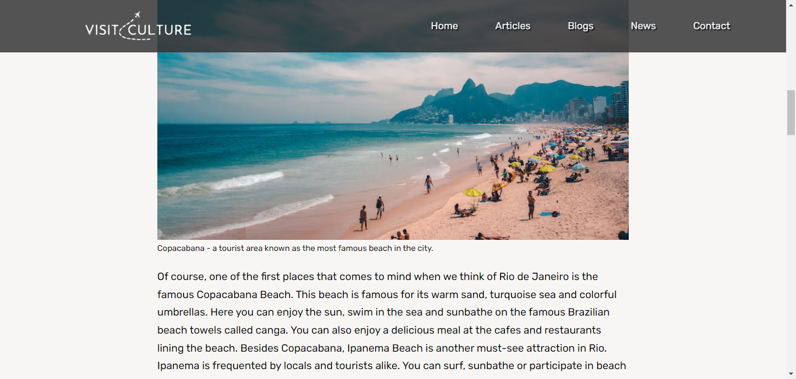
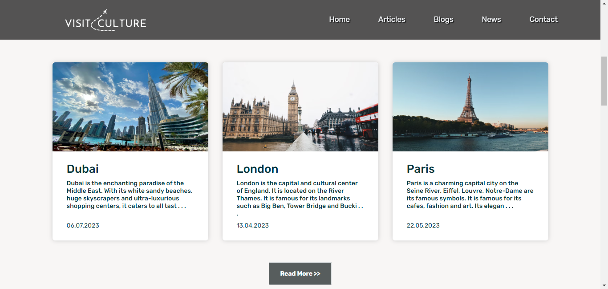

# visitculture.com

Introducing VisitCulture.com, a captivating website that encompasses a wide array of content, including blogs, country articles, and global news. Immerse yourself in a world of cultural exploration as you delve into our rich collection of insightful blog posts, offering unique perspectives on various aspects of art, history, and traditions. Discover fascinating country articles that shed light on the diverse cultures around the globe, providing a deeper understanding of their customs, landmarks, and local experiences.

## Used Technologies

- Next.js
- Supabase
- Aos (animation library)
- React Icons
- Google Analytics

live: https://visitculture.com
